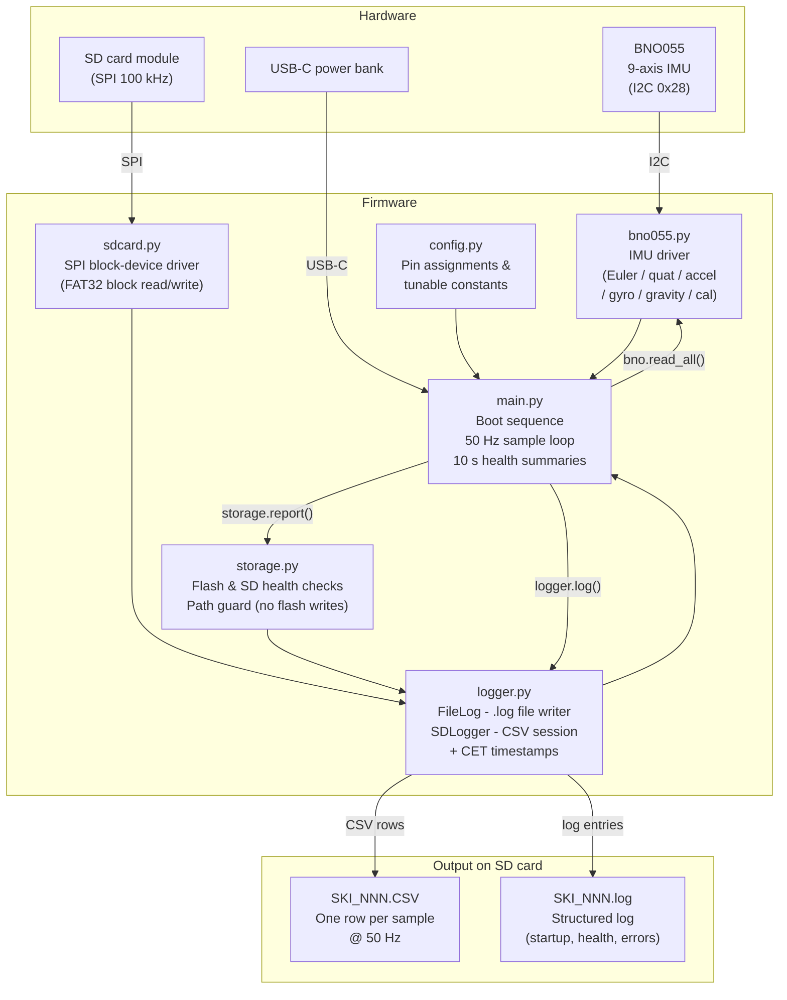

# Ski IMU Logger - RP2350 + BNO055

Firmware for a standalone ski motion logger. Samples a 9-axis BNO055 IMU at 50 Hz
and writes every sensor field to a timestamped CSV file on a MicroSD card.
A matching `.log` file records startup health checks, calibration status, and
periodic write summaries - all without needing a connected PC.

---

## Hardware

| Component | Part | Link |
|-----------|------|------|
| Microcontroller | RP2350-Zero (MicroPython) | [bastelgarage.ch](https://www.bastelgarage.ch/rp2350-zero-mini-raspberry-pi-pico-basierter-mcu?search=rp2350) |
| IMU | BNO055 9-axis sensor | [bastelgarage.ch](https://www.bastelgarage.ch/bno055-intelligent-9-achsen-sensor?search=bno055) |
| SD module | Micro SD Card Reader (purecrea) | [bastelgarage.ch](https://www.bastelgarage.ch/micro-sd-card-reader-modul?search=sd%20reader) |
| SD card | Intenso 16 GB (FAT32) | - |
| Power | USB-C power bank | - |

---

## Wiring

### RP2350 → BNO055 (I2C0)

| RP2350 pin | BNO055 pin |
|-----------|-----------|
| GND | GND |
| 3V3 | VCC |
| GP0 | SDA |
| GP1 | SCL |

### RP2350 → SD card module (SPI0)

| RP2350 pin | SD module pin |
|-----------|--------------|
| GND | GND |
| **VBUS (5 V)** | VCC |
| GP2 | SCK |
| GP3 | MOSI |
| GP4 | MISO |
| GP5 | CS |

> **Note:** The SD module's VCC must be 5 V so its onboard LDO can supply a
> stable 3.3 V to the SD card. The MISO signal is safe at 3.3 V because it
> comes directly from the SD card, not from the 5 V rail.
> SPI runs at **100 kHz** - the module's level-shifter adds propagation delay
> that causes data-token misses at higher clock rates.

---

## System architecture

---

## Module overview

### [`config.py`](config.py)
Single source of truth for every pin number and tunable constant.
Change `SPI_BAUD`, `SAMPLE_RATE_HZ`, `BUFFER_SIZE`, or `CET_OFFSET_H` here
and the rest of the firmware picks them up automatically.

### [`bno055.py`](bno055.py)
Register-level MicroPython driver for the BNO055.
Operates in **NDOF** (9-axis sensor fusion) mode and exposes individual reads
(`euler()`, `quaternion()`, `linear_accel()`, `gyro()`, `gravity()`,
`calibration()`) as well as a batched `read_all()` that fetches all fields in
two I2C transactions - minimising bus time at 50 Hz.

### [`sdcard.py`](sdcard.py)
Low-level SPI block-device driver for FAT32 SD cards, based on the
MicroPython-lib reference implementation.
Handles the full SPI SD init sequence (CMD0 → CMD8 → ACMD41 → CMD58 → CMD9),
single- and multi-block reads (CMD17/18), and single- and multi-block writes
(CMD24/25) with correct busy-wait after stop tokens.
Mounted via `uos.mount()` so the standard `open()` / `os` APIs work normally.

### [`storage.py`](storage.py)
Runs storage health checks at startup.
Reports internal flash usage, lists every file on flash and warns if data files
ended up there by mistake, checks SD free space, and enforces a minimum free
threshold before allowing logging to start.
`guard_path()` raises `RuntimeError` if any file open would land on internal
flash instead of `/sd/`.

### [`logger.py`](logger.py)
Two classes that together manage all file I/O:

- **`FileLog`** - Timestamped `.log` writer. Messages written before the SD
  card is mounted are buffered in RAM and flushed once `open()` is called.
  Every entry is also echoed to the USB serial port, so you can watch the
  boot sequence live while connected to a PC. Warns and errors are flushed
  immediately; info entries are batched.

- **`SDLogger`** - Opens matching `SKI_NNN.CSV` and `SKI_NNN.log` files,
  writes the CSV header, and buffers sensor rows in RAM. Flushes to SD every
  `BUFFER_SIZE` samples (~1 s at 50 Hz). Each CSV row carries a
  `datetime_cet` column (computed from the RTC at session start, no per-row
  RTC call) and an `elapsed_ms` column for precise relative timing.

### [`main.py`](main.py)
Entry point - executed automatically on every power-up.
Runs the boot sequence (BNO055 detection, flash audit, SD mount, storage
check, session open), then enters the 50 Hz sample loop.
Every `LOG_INTERVAL_SAMPLES` (500 samples = 10 s) it writes a health summary
line to the log: entries written, achieved sample rate, calibration status,
and SD free space.
Handles remount on transient SD write errors and closes the session cleanly on
`KeyboardInterrupt`.

### [`main.py`](main.py) - boot sequence
1. 3 s startup delay for BNO055 to settle
2. I2C scan + BNO055 detect and init
3. Internal flash audit
4. SD card mount
5. Full storage report (with SD)
6. Open CSV + matching `.log` session files
7. Sample at 50 Hz; flush to SD every 50 samples (~1 s)
8. Write health summary to log every 10 s (`LOG_INTERVAL_SAMPLES`)
9. Power-loss or `Ctrl+C` → close session gracefully

All output goes to both USB serial and the `.log` file. Designed to run
unattended without a terminal.

### [`test.py`](test.py)
Four-phase integration test - run while connected to a PC via Thonny.

| Phase | What it tests |
|-------|--------------|
| 0 | Storage audit - internal flash usage, SD space check |
| 1 | BNO055 only - 10 s of live sensor readings to serial |
| 2 | SD card - mount, storage report, create `SKI_NNN.CSV` |
| 3 | Combined - BNO055 at 50 Hz streamed into the CSV |

### [`test_hardware.py`](test_hardware.py)
Hardware bring-up test suite - run before every field deployment.

| Group | Tests |
|-------|-------|
| `INFRA` | MicroPython version, flash space, no stray data files |
| `PINS` | MISO pull-up, CS toggle, SDA/SCL not shorted |
| `I2C` | Bus scan, BNO055 address, chip ID `0xA0`, self-test |
| `SPI` | SD driver init, single-block read, write-verify, multi-block write |
| `FS` | FAT32 mount, free space ≥ 50 MB, file create/read/delete |
| `IMU` | NDOF mode, Euler range, quaternion unit, gravity magnitude, sample rate, data freshness |

Tests that depend on missing hardware are automatically skipped rather than
erroring. Results are saved to `/sd/TEST_HW.log` if the card is available.

---

## CSV output format

Each row is one 50 Hz sample. Columns:

| Column | Unit | Description |
|--------|------|-------------|
| `datetime_cet` | ISO 8601 | Timestamp with CET offset, ms precision |
| `elapsed_ms` | ms | Milliseconds since session start |
| `euler_heading` | ° | Heading (0–360) |
| `euler_roll` | ° | Roll |
| `euler_pitch` | ° | Pitch |
| `quat_w/x/y/z` | - | Unit quaternion |
| `accel_x/y/z` | m/s² | Linear acceleration (gravity removed) |
| `gyro_x/y/z` | °/s | Angular velocity (see note below) |
| `gravity_x/y/z` | m/s² | Gravity vector |
| `calibration_sys/gyro/accel/mag` | 0–3 | BNO055 calibration status (3 = fully calibrated) |

> **Gyro units:** The BNO055 default unit is degrees/s with 16 LSB per °/s.
> The driver divides by 16, giving **°/s** - not rad/s as the datasheet
> header implies. To convert to rad/s multiply by `π / 180 ≈ 0.01745`.

> **`sdcard.py` source:** Based on the MicroPython-lib reference driver
> (MIT licence, Damien P. George et al.), bundled here so the firmware is
> fully self-contained on the device filesystem.

---

## First-time setup

1. **Flash MicroPython** onto the RP2350 by holding BOOTSEL while plugging in,
   then copying the firmware UF2 from
   [files.waveshare.com](https://files.waveshare.com/wiki/common/WAVESHARE_RP2350B.zip).

2. **Upload all `.py` files** to the root of the device using Thonny
   (View → Files → drag to device).

3. **Format the SD card as FAT32** (not exFAT) in Windows before first use.

4. **Verify with `test.py`** - open Thonny, run `test.py`, confirm all three
   phases pass before deploying.

---

## Normal operation

| Situation | What to do |
|-----------|-----------|
| Start a session | Plug into any USB-C power bank |
| Stop a session | Unplug (up to ~1 s of buffered data may be lost) |
| Clean shutdown via PC | Press `Ctrl+C` in Thonny - session closes gracefully |
| Force restart | Press the **RUN** button |
| Flash new firmware | Hold **BOOTSEL** while plugging in |

---

## Common failure points

- **Loose jumper wires** - most issues trace back to a slightly unseated jumper,
  particularly on CS or MISO.
- **Wrong VCC for SD module** - the module needs 5 V in; 3.3 V starves the
  onboard LDO and the card never completes ACMD41 initialisation.
- **SD card formatted as exFAT** - MicroPython's FAT driver does not support
  exFAT; reformat as FAT32.
- **BNO055 not calibrated** - `calibration_sys = 0` in the CSV means fusion
  output is unreliable. Move the sensor through a figure-8 pattern to
  calibrate the magnetometer before recording.
